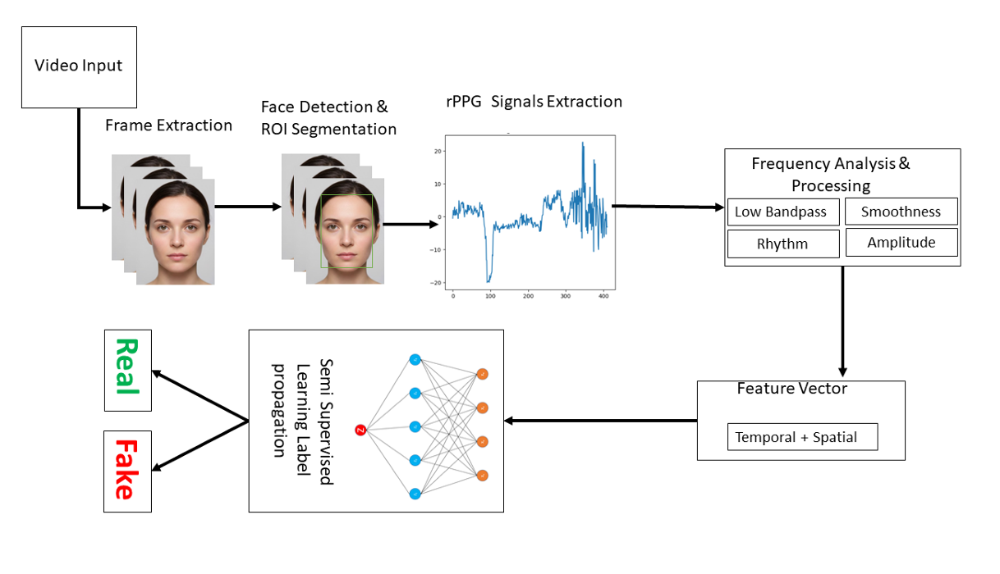
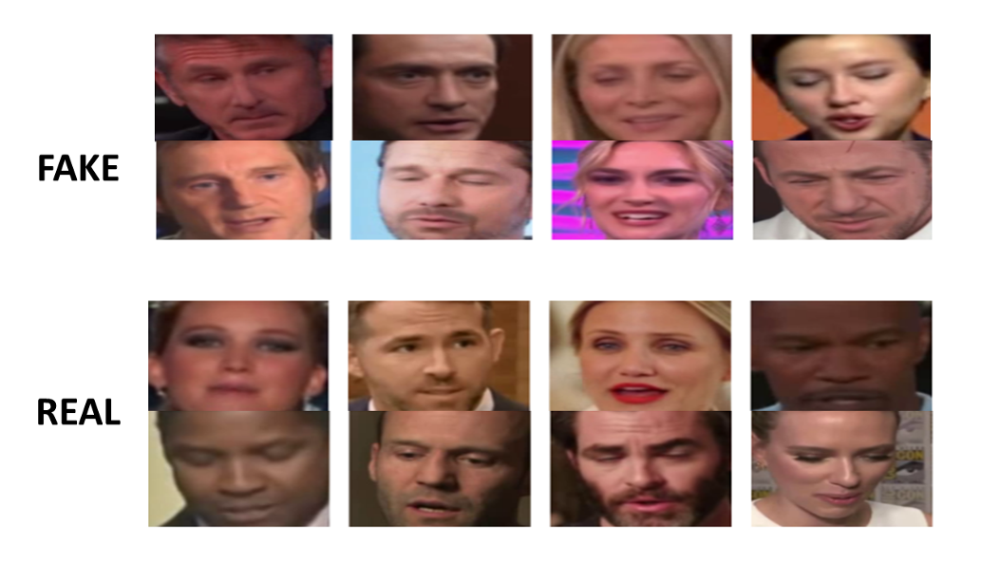
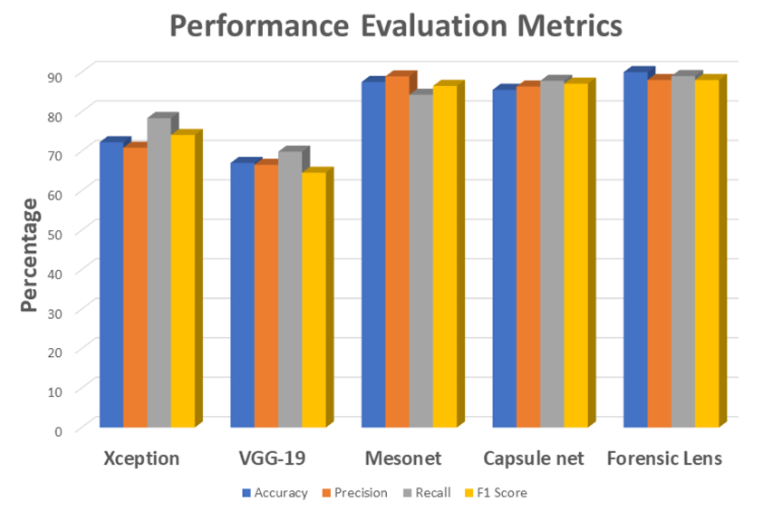
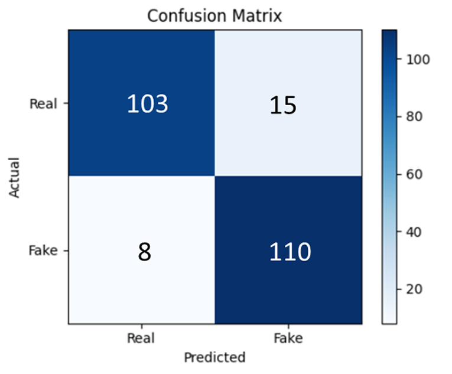
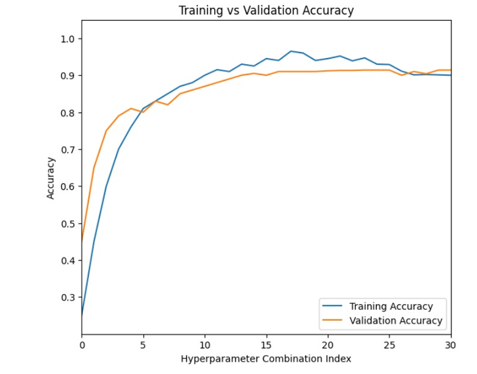
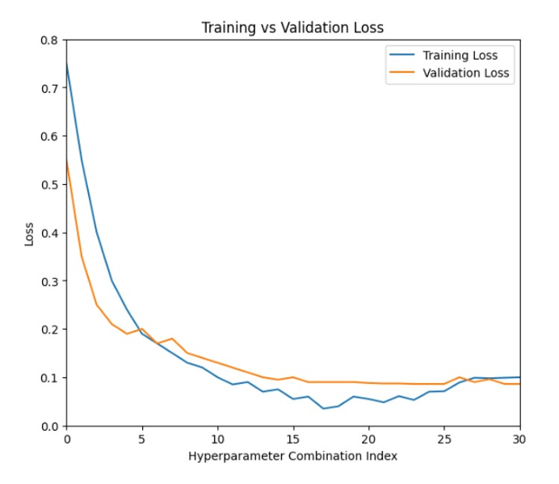

# Forensic Lens

## Deepfake Detection Through Micro-Level Facial Blood-Flow Signals

Forensic Lens is a research project focused on deepfake detection through subtle physiological signals present in facial video.

The research investigates whether remote photoplethysmography (rPPG) signals extracted from facial regions can provide useful forensic indicators for distinguishing authentic videos from manipulated content.

---

## Research Overview

Deepfake detection is commonly approached through visual artifacts, facial inconsistencies, and deep learning-based analysis.

Forensic Lens explores a different direction by examining micro-level facial blood-flow signals that can be extracted remotely from video.

The proposed approach analyzes temporal variations in facial regions of interest and extracts physiological information that can be used for real-versus-fake classification.

---

## Research Pipeline

The research pipeline consists of:

1. Video input
2. Frame extraction
3. Face detection and facial region-of-interest extraction
4. rPPG signal extraction
5. Signal processing and feature extraction
6. Classification
7. Real / Fake prediction

---

## Dataset

The study uses the **Celeb-DF V2** deepfake dataset containing authentic and manipulated facial videos.

The dataset was processed for experimental evaluation using the methodology described in the research paper.

> The dataset itself is not included in this repository.

---

## Experimental Results

The reported experimental results are:

| Metric | Result |
|---|---:|
| Accuracy | **90%** |
| Precision | **88%** |
| Recall | **89%** |
| F1 Score | **88%** |
| False Positive Rate | **6.78%** |
| False Negative Rate | **12.71%** |

### Performance Comparison

The comparison figure presents the reported performance of the proposed approach against other deepfake detection approaches discussed in the study.

---

## Confusion Matrix

The reported confusion matrix contains:

| | Predicted Real | Predicted Fake |
|---|---:|---:|
| **Actual Real** | 103 | 15 |
| **Actual Fake** | 8 | 110 |

---

## Training Performance

### Accuracy

### Loss

These figures present the training and validation performance reported in the research study.

---

## Key Research Concepts

- Deepfake Detection
- Digital Forensics
- Remote Photoplethysmography (rPPG)
- Facial Region-of-Interest Analysis
- Physiological Signal Analysis
- Computer Vision
- Machine Learning
- Media Authentication

---

## Research Contributions

The research investigates the use of physiological facial signals as an additional forensic signal for deepfake detection.

The approach focuses on subtle temporal variations in facial regions and explores whether these signals can help distinguish authentic media from manipulated media.

---

## Limitations and Future Work

The research identifies several areas for further investigation, including:

- Cross-dataset evaluation
- Robustness against video compression
- Performance under low-light conditions
- Motion blur and challenging video conditions
- Multimodal physiological and behavioral signals
- Real-time and lightweight deployment

---

## Code Availability

The original implementation used during the research study is currently unavailable.

This repository therefore serves as a **research documentation archive** containing the published research paper, methodology figures, experimental results, and supporting documentation.

No claim is made that the original source code is available in this repository.

---

## Research Paper

The complete research paper is available here:

**[Read the Forensic Lens Research Paper](paper/forensic-lens-research-paper.pdf)**

---

## Citation

If you reference this research, please cite the published paper.

---

## Disclaimer

This repository is provided for research and educational purposes. The datasets and third-party resources referenced in the research are not redistributed through this repository and remain subject to their respective licenses and terms of use.
